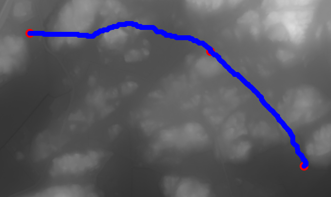

# Pathfinding - 
 

Detta projekt har som syfte att underlätta vägval för orienterare och andra kartanvändare. Användaren får välja minst två punkter på en karta och då kommer vårt program hitta bästa vägen mellan noderna som undviker höjdkurvor. 


## A*
Vi använder en sökalgoritm vid namn A* (A-star). Denna algoritm kombinerar två värden, det första värdet är kostnaden mellan startnoden och ens nuvarande position, och det andra värdet är det potentiella kostnaden mellan ens nuvarande position och slutnoden

### Exempel A*
[](tps://sv.wikipedia.org/wiki/A*_S%C3%B6kalgoritm#/media/Fil:Astar_progress_animation.gif)

[Mer om A*-algoritmen på Wikipedia](https://sv.wikipedia.org/wiki/A*_S%C3%B6kalgoritm)

## Features
- A* sök-algoritm som i realtid målar ut smidigaste vägen mellan två punkter
- Läser in gråskaliga pgm-filer som höjddata
- Ett webgränssnitt som underlättar människa-datainteraktion

## Exempel på väg genom punkter



## Hur man använder programmet

Se till att ha https://github.com/Theldus/wsServer installerad på datorn

1. Klona repot:
   ```bash
   git clone https://github.com/PEOL0/projinda-pathfinding

   cd projinda-pathfinding/src/networking

   make run

1. Öppna upp index.html i en browser (kan göras med live server)
2. Välj område att visa
3. Klicka på start och slutpunkt på kartan som visas. 
4. Klicka på "Create Best Route!"
5. Nu ska den smidigaste vägen mellan de två punkterna visas!


## Buggar och TODOs
Vi är medvetna om vissa buggar som finns i detta projekt, och ämnar att lösa dem så fort tid finns. Vi har också vissa implementationer vi vill genomföra snarast möjliga. 

### Buggar
- Problem med olika skärmstorlekar. Skärm större/mindre än bilden ibland
- Man kan inte klicka längst ut på kanterna

### TODOs
- Lägga till fler områden att välja kartor från 
- Linea upp en terrängkarta över området med den faktiska höjdkartan för att underlätta användarvänligheten
- Flytta makefile till ett mer lättåtkommligt ställe


## Authors: 
-  - Peter Lindvall
-  - Sofia Wallgren